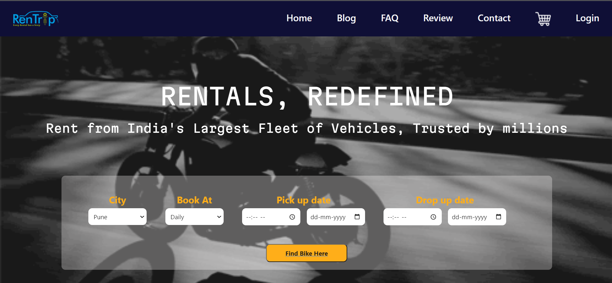
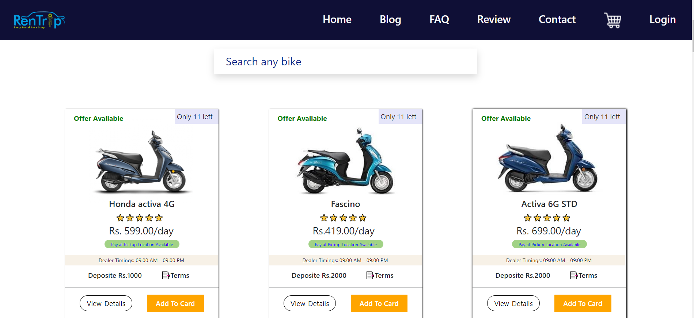

# Project Name :  Rentrip

 

# Introduction : 
#### Welcome to the Bike Rental System! This project allows users to rent bikes for various durations. Whether you're a bike rental shop owner or a customer looking to rent a bike, this system has you covered.

## Bike Renting view

 

# Description

Bike rental is a web application built with React for searching bikes on rent . When a user searches for a Bike  the particular bike is search and user book bike in low cost and enjoy your journey....

# Features: 
### . Browse available bikes
### . Rent bikes for specific durations
### . View rental history

# Usages :
##   This website  is useful for rent the bike in different city which is particular duration......

### Contributors 👏🤝

